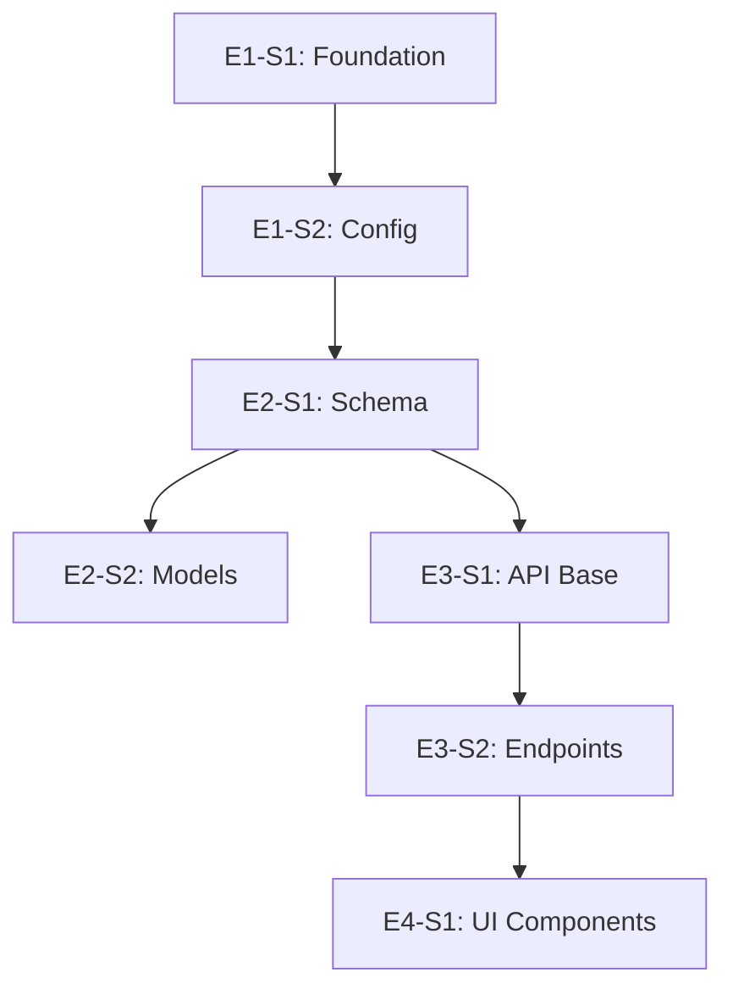

# Plan Command

Transforms a spec into atomic, implementable stories organized into epics. Each story is sized to complete in one context window with TDD.

## Command Syntax

```
/plan docs/spec.md           # Plan from spec file
/plan                        # Interactive - asks for spec location
```

## Output

Single file: `docs/plan.md`

---

## Planning Philosophy

### What Makes a Story "Atomic"?

A story is atomic when it can be:
1. **Completed in one context window** (~30-50 files read, ~500 lines written)
2. **Tested independently** (has clear acceptance criteria)
3. **Committed as one unit** (single coherent change)
4. **Demoed or verified** (visible progress)

### Story Sizing Guide

| Size | Scope | Examples |
|------|-------|----------|
| **XS** | Single function/component | Add validation to form field, Create utility function |
| **S** | Small feature slice | Add API endpoint, Create React component with tests |
| **M** | Feature with integration | Form + API + validation, Component + state management |
| **Too Big** | Split it | "Add authentication" → login, signup, forgot password, session mgmt |

**Target size: S to M.** If it feels like L, split it.

---

## Process

### Step 1: Read and Analyze Spec

```
1. Read the spec.md file
2. Identify:
   - Core features (Must Have items)
   - Technical constraints
   - Integration points
   - Quality bar (prototype vs production)

3. Map dependencies:
   - What must exist before other things can be built?
   - What can be built in parallel?
```

### Step 2: Identify Epics

Group related work into epics. Typical epic patterns:

| Epic Type | Contains |
|-----------|----------|
| **Foundation** | Project setup, config, base infrastructure |
| **Data Layer** | Schema, models, database setup |
| **Core Logic** | Business logic, services, utilities |
| **API Layer** | Endpoints, middleware, validation |
| **UI Components** | Reusable components, design system pieces |
| **Features** | User-facing feature slices |
| **Integration** | External service connections |
| **Polish** | Error handling, edge cases, cleanup |

### Step 3: Break Epics into Stories

For each epic, create stories following this pattern:

```markdown
### Story: [ACTION] [THING] [CONTEXT]

**Goal**: [One sentence - what does "done" look like?]

**Acceptance Criteria**:
- [ ] [Specific, testable criterion]
- [ ] [Another criterion]
- [ ] Tests pass
- [ ] [For UI: Verify in browser]

**Technical Notes**:
- [Files to create/modify]
- [Patterns to follow]
- [Dependencies on other stories]
```

**Story Naming Convention**:
- `Add [thing]` - New functionality
- `Create [thing]` - New file/component/module
- `Implement [thing]` - Business logic
- `Connect [A] to [B]` - Integration
- `Update [thing]` - Modification
- `Fix [thing]` - Bug fix (rare in greenfield)

### Step 4: Order by Dependencies

Sequence stories so each can be built on completed work:

```
1. Foundation stories (no dependencies)
2. Data/schema stories (depend on foundation)
3. Core logic stories (depend on data)
4. API stories (depend on core logic)
5. UI stories (depend on API)
6. Integration stories (depend on UI + API)
7. Polish stories (depend on everything)
```

### Step 5: Validate Story Sizing

For each story, ask:
- [ ] Can this be done in one TDD cycle?
- [ ] Are acceptance criteria testable?
- [ ] Is the scope clear and bounded?
- [ ] Does it produce demonstrable progress?

If any answer is "no", split the story.

### Step 6: Generate Plan

Output `docs/plan.md` with the complete structure.

---

## Output Format: plan.md

```markdown
# Implementation Plan: [Project Name]

> [One-line description from spec]

**Source**: [path/to/spec.md]
**Generated**: [date]
**Total Stories**: [count]
**Estimated Epics**: [count]

---

## Epic 1: [Epic Name]

**Goal**: [What this epic accomplishes]
**Stories**: [count]

### Story 1.1: [Story Title]

**ID**: `E1-S1`
**Size**: S | M
**Depends On**: None | [Story IDs]

**Goal**: [One sentence]

**Acceptance Criteria**:
- [ ] [Criterion 1]
- [ ] [Criterion 2]
- [ ] Tests pass

**Technical Notes**:
- Files: [list]
- Pattern: [reference to existing code]

---

### Story 1.2: [Story Title]

**ID**: `E1-S2`
**Size**: S
**Depends On**: E1-S1

...

---

## Epic 2: [Epic Name]

**Goal**: [What this epic accomplishes]
**Stories**: [count]

### Story 2.1: [Story Title]

...

---

## Dependency Graph



## Execution Order

| Order | Story ID | Title | Epic |
|-------|----------|-------|------|
| 1 | E1-S1 | [Title] | Foundation |
| 2 | E1-S2 | [Title] | Foundation |
| 3 | E2-S1 | [Title] | Data Layer |
| ... | ... | ... | ... |

## Parallel Opportunities

Stories that can be worked on simultaneously (no dependencies between them):

- **Group A**: E2-S2, E2-S3 (both depend only on E2-S1)
- **Group B**: E4-S1, E4-S2 (independent UI components)

---

## Open Questions

- [ ] [Any unresolved questions from spec]
- [ ] [Decisions deferred to implementation]

---

## Ready for Linear Sync

Run `/sync-linear docs/plan.md` to create tickets.

---

*Generated by /plan command*
```

---

## Validation Checklist

Before finalizing the plan, verify:

- [ ] Every "Must Have" from spec has corresponding stories
- [ ] No story is larger than "M" size
- [ ] Dependencies are explicit and acyclic
- [ ] Each story has testable acceptance criteria
- [ ] Execution order respects dependencies
- [ ] First epic produces runnable/demoable output

---

## Tips

1. **Start with the happy path**: Foundation → Core → UI → Polish
2. **Keep stories vertical**: Each touches one slice, not horizontal layers
3. **Err toward smaller**: Two XS stories > one M story
4. **Name concretely**: "Create UserService" not "Set up services"
5. **Include tests in scope**: Every story includes its tests

---

*Version: 1.1 - Trimmed worked example; format spec is authoritative*
