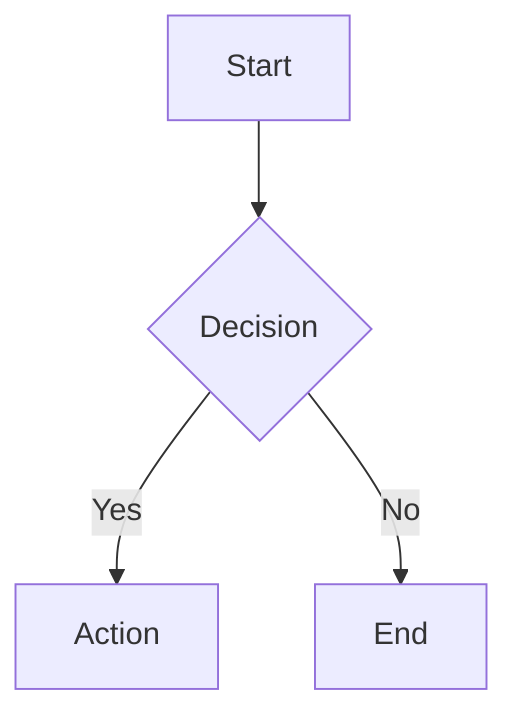
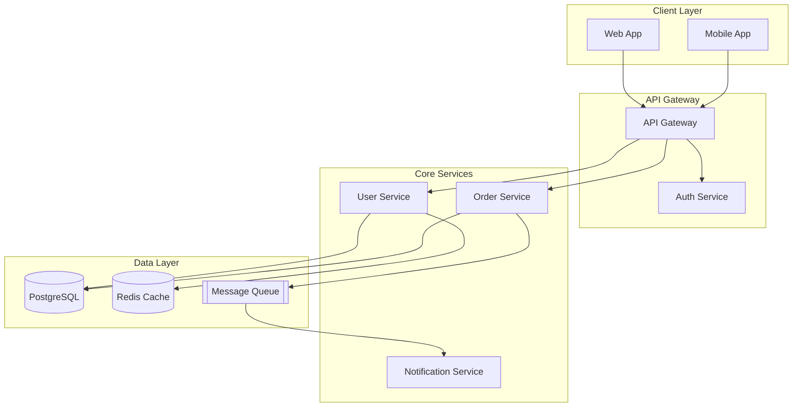

# Diagram Generation Rules

## beautiful-mermaid Configuration

All Mermaid diagrams in documentation MUST be rendered using the `beautiful-mermaid` package. This provides professional, themeable diagrams that look great in both light and dark mode.

## Default Theme Selection

Use these themes based on context:

| Context | Theme | Rationale |
|---------|-------|-----------|
| Default/General | `tokyo-night` | Professional dark theme, high readability |
| Light mode docs | `github-light` | Clean, familiar GitHub aesthetic |
| Architecture docs | `nord` | Calm, focused aesthetic for complex diagrams |
| Marketing/External | `catppuccin-mocha` | Distinctive, memorable appearance |

## Theme Definitions (for reference)

```typescript
import { THEMES } from 'beautiful-mermaid';

```

## Usage Pattern

When generating diagrams in markdown documents:

### Standard Mermaid Block (for GitHub/GitLab rendering)
Use standard mermaid code blocks - they render natively in most platforms:



### For SVG Export (documents, presentations)
When you need to export diagrams as SVG files, use beautiful-mermaid:

```typescript
import { renderMermaid, THEMES } from 'beautiful-mermaid';

const svg = await renderMermaid(`
  flowchart TD
    A[Start] --> B{Decision}
    B -->|Yes| C[Action]
    B -->|No| D[End]
`, THEMES['tokyo-night']);
```

## Diagram Type Guidelines

Choose the appropriate Mermaid diagram type:

| Purpose | Diagram Type | Example |
|---------|--------------|---------|
| System architecture | `flowchart TD` or `flowchart LR` | Component relationships |
| Data models | `erDiagram` | Database schemas |
| API flows | `sequenceDiagram` | Service interactions |
| State machines | `stateDiagram-v2` | Workflow states |
| Class hierarchies | `classDiagram` | Object relationships |

## Formatting Standards

1. **Direction**: Use `TD` (top-down) for hierarchical flows, `LR` (left-right) for sequential processes
2. **Node naming**: Use descriptive IDs (`UserService`, not `A`)
3. **Edge labels**: Keep labels concise (3-5 words max)
4. **Subgraphs**: Group related components for clarity
5. **Styling**: Let the theme handle colors - don't add inline styles

## Example: Architecture Diagram



## ASCII Art Prohibition

**NEVER use ASCII box-drawing characters for diagrams.** This includes:
- Box characters: `┌ ┐ └ ┘ │ ─ ├ ┤ ┬ ┴ ┼`
- Arrow characters: `→ ← ↑ ↓ ▶ ▼`
- Manual spacing/alignment for visual diagrams

Instead, always use Mermaid syntax which:
- Renders beautifully with beautiful-mermaid themes
- Is version-controllable
- Displays correctly on all platforms
- Can be exported as high-quality SVG

## Exception: Dependency Trees

For simple dependency trees in plan documents, a plain text tree format is acceptable:

```
E1-S1 (Foundation)
  ├── E1-S2 (Config)
  │    └── E2-S1 (Schema)
  └── E2-S2 (Models)
```

But for anything more complex, use Mermaid.
